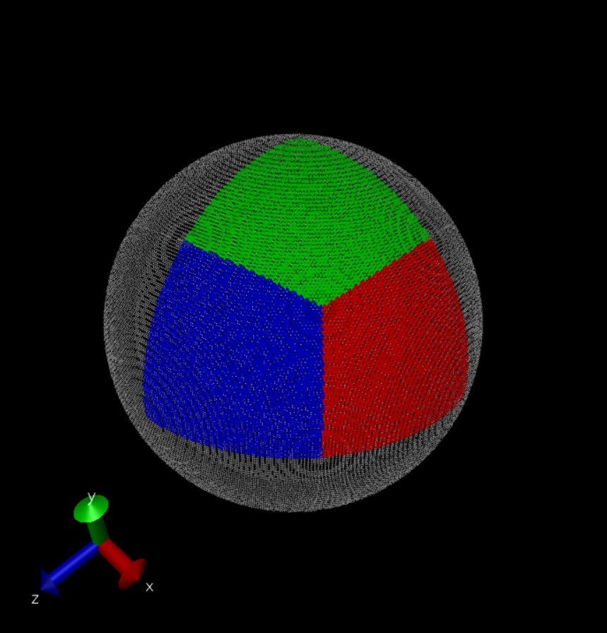

# draw_sphere

Let's draw sphere in different ways!
- [x] Loop #1
- [x] Recursion #1
- [ ] Others

***

## Loop #1

### Benchmark performance: 0.087s
### Total points: 125834

### Method: 

1. Iterate Z-axis [0, r], val: c
2. Iterate X-axis [r, c], val: a 
3. Iterate Y-axis [0, a], val: b
4. Draw a point (a, b, c) in the red area  
5. Draw a point (b, a, c) in the green area 
6. Draw a point (c, b, a) in the blue area
7. Iterate 8 octants (+,+,+) to (-,-,-)

### Representation (VMD):

***

### Benchmark performance: 2.988s
### Total points: 125858

### Method:

1. Go over the first octant, find a qualified point (a, b, c)
2. Store the point (a, b, c)
3. Move the point, one direction at one time
    * (a +/- resolution, b, c)
    * (a, b +/- resolution, c)
    * (a, b, c +/- resolution)   
4. Iterate 8 octants (+,+,+) to (-,-,-)

### Representation (VMD):

***

