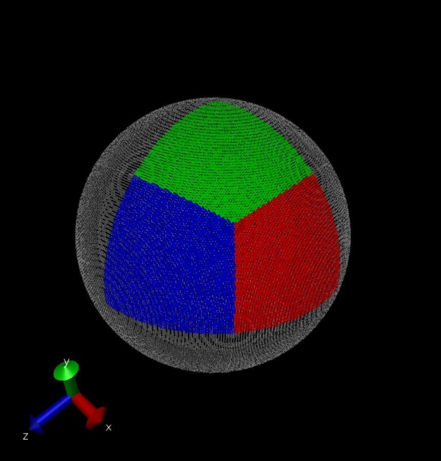
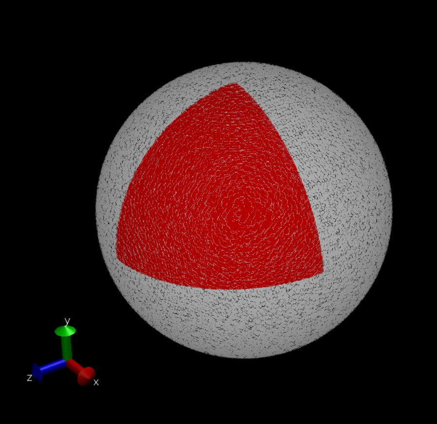
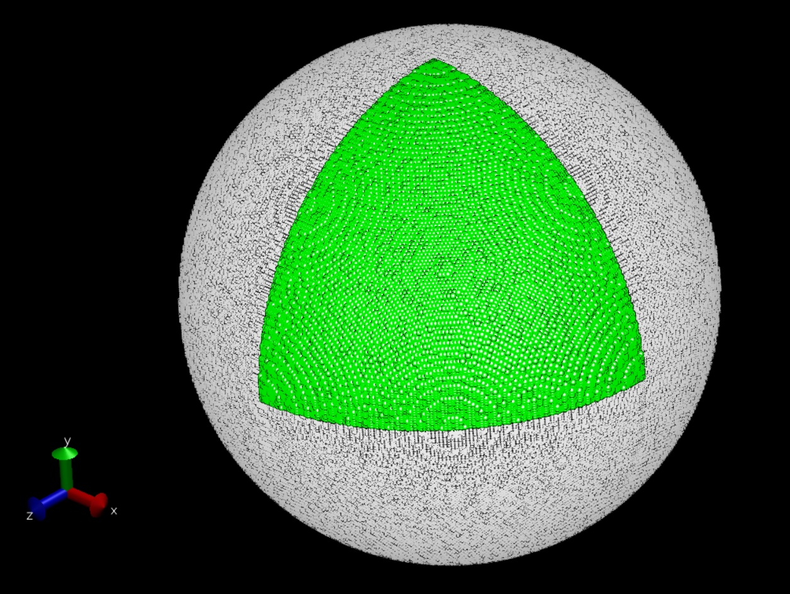
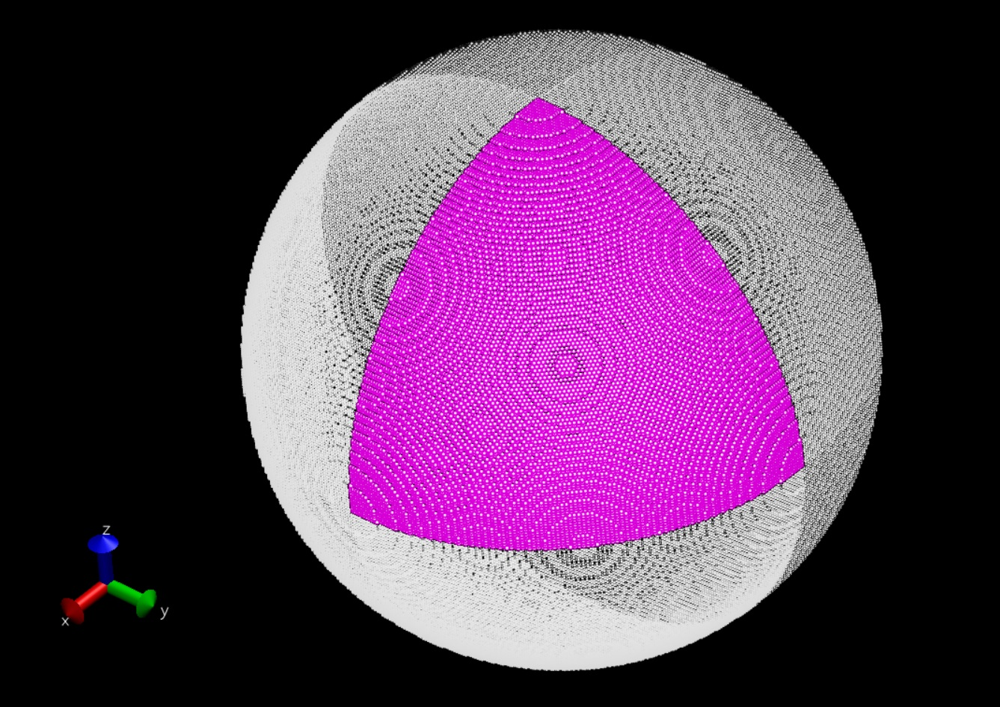
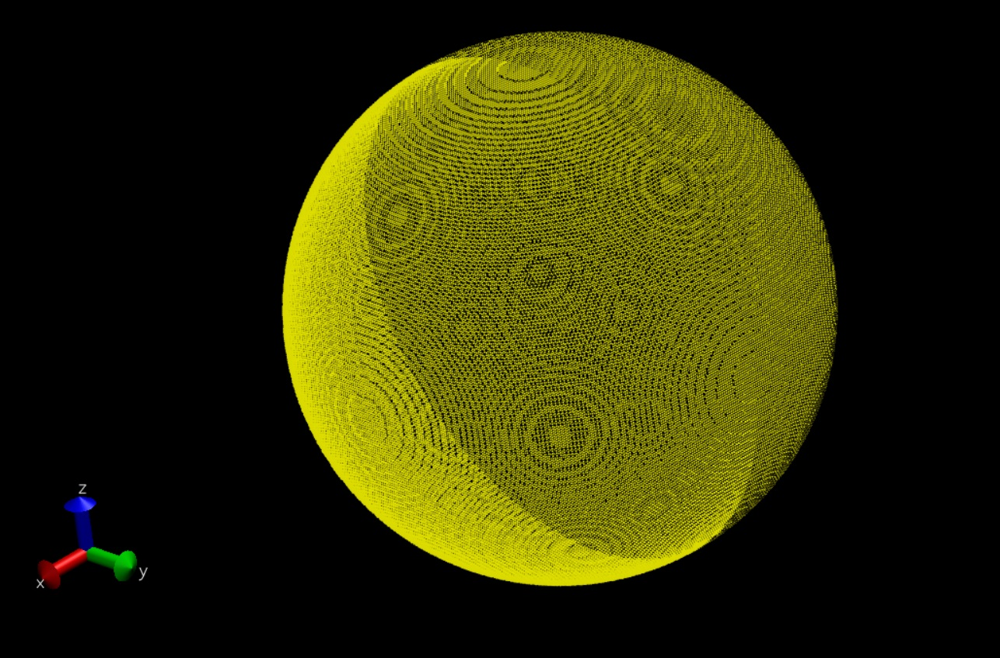

# draw_sphere

Let's draw sphere in different ways!
- [x] Loop #1 Devide-n-Conquer
    - [X] Python
    - [X] C++
- [x] Recursion #1
    - [X] Python
    - [X] C++
- [x] Loop #2 Geometry
    - [X] Python
    - [ ] C++
- [x] Loop #3 Brute-Force
    - [ ] Python
    - [X] C++
    - [X] CUDA
- [x] Loop #4 Brute-Force All
    - [ ] Python
    - [X] C++
    - [X] CUDA
- [ ] Others

***

## Loop #1 Devide-n-Conquer

### Benchmark performance: 
* Python: 0.087s
* C++: 0.682s
### Total points: 
* Python: 125834
* C++: 127560

### Method: 

1. Iterate Z-axis [0, r], val: c
2. Iterate X-axis [r, c], val: a 
3. Iterate Y-axis [0, a], val: b
4. Draw a point (a, b, c) in the red area  
5. Draw a point (b, a, c) in the green area 
6. Draw a point (c, b, a) in the blue area
7. Iterate 8 octants (+,+,+) to (-,-,-)

### Representation (VMD):

***

## Recursion #1

### Benchmark performance: 
* Python: 2.988s
* C++: 14.581s
### Total points: 
* Python: 125858
* C++: 127752

### Method:

1. Go over the first octant, find a qualified point (a, b, c)
2. Store the point (a, b, c)
3. Move the point, one direction at one time
    * (a +/- resolution, b, c)
    * (a, b +/- resolution, c)
    * (a, b, c +/- resolution)   
4. Iterate 8 octants (+,+,+) to (-,-,-)

> **_Note_**:  
> If the terminal complains about `Segmentation fault (core dumped)`, 
> modify `ulimit` in termial with the command below:
> `ulimit -s unlimited`

### Representation (VMD):

***

## Loop #2 Geometry

### Benchmark performance: 
* Python: 0.088s
* C++: 
### Total points: 
* Python: 125858
* C++: 

### Method: 

1. Iterate Z-axis [0, r], val: c
2. Iterate X-axis [r, c], val: a 
3. Get the y-axis coordinate is ~= b, val: b
4. Draw a point (a, b, c) in the green area  
6. Draw a point (c, b, a) in the green area
7. Iterate 8 octants (+,+,+) to (-,-,-)

### Representation (VMD):

***

## Loop #3 Brute-Force

### Benchmark performance: 
* Python: 
* C++: 0.506s
* CUDA: 0.490s
### Total points: 
* Python: 
* C++: 127856
* CUDA: 127840

### Method: 

1. Generate 1-D array, length: ((N+1) * (N+1) * (N+1))
2. Iterate the array, mark qualified points in the megenta region
3. Iterate 8 octants (+,+,+) to (-,-,-)

### Representation (VMD):

***

## Loop #3 Brute-Force All

### Benchmark performance: 
* Python: 
* C++: 0.518s
* CUDA: 0.508s
### Total points: 
* Python: 
* C++: 125930
* CUDA: 125914

### Method: 

1. Generate 1-D array, length: ((2N+1) * (2N+1) * (2N+1))
2. Iterate the array, mark qualified points in the yellow region

### Representation (VMD):

***
